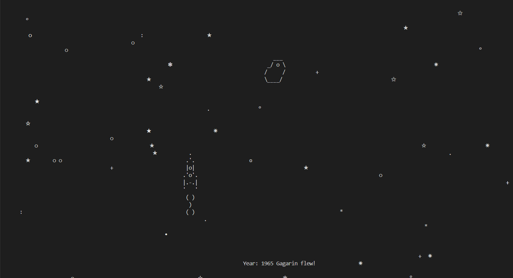
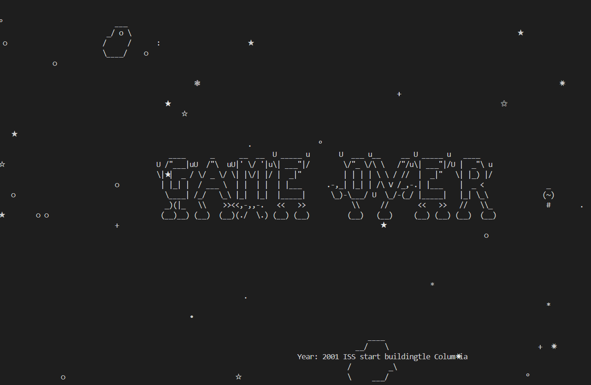

# Игра про космос


___
#### Это проект предстовляет из себя игру про космос. <p>Во время игры включается счетчик лет начиная с 1957 года и до ... года.<p>С каждым годом сложность игры будет увеличиваться, сначало будет появлятся космический мусор, а после 2020 года у карабля появляется огненная пушка для уничтожения космического мусора.<p>После ... года, если вас не заденет ни один из космического мусора, то вы выйграете и игра опевестит вас об этом.<p>Узнайте поскорей до какого года вы сможете протянуть
___
>### Для запуска программы требуется:
 * скачать [Python](https://www.python.org/) версии 3.9 или выше.
 * операционная система macOS, linux, windows 10 или выше.
 * установить все нужные библиотеки Python командой:
 1. Для Windows OC:

```
pip install -r requirements.txt
```

 2. Для Linux и MacOS:

```
pip3 install -r requirements.txt
```
___
>### Как запустить программу:

* Для запуска программы требуется, написать в консоль комманду:
1. Для Windows OC:

```
python main.py
``` 
 2. Для Linux и MacOS:
```
python3 main.py
```
___
>### Пример работающей игры

* Если вы не хотите скачивать код, то вы можете поиграть в эту игру перейдя по [ссылке](https://replit.com/@ArtiomGierasim2/cosmosgame) на Replit. `Совет`: полностью разверните консоль, для комфортной игры.

* В `Replit` в консоле напишите команду
```
python main.py
```


<br>

___
>### Цель проекта:
* Код написан в образовательных целях.